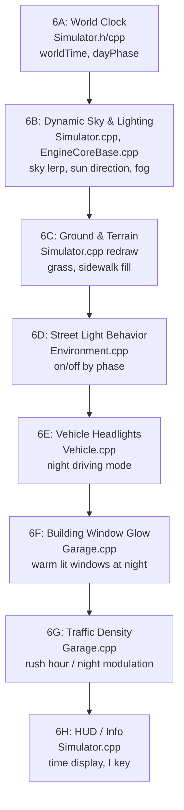

# Phase 6: Living City — Day/Night Cycle, Ambient Environment & Behavioral Realism

## The Problem

Right now the city looks like a collection of objects floating on a black void. The sky is a flat blue, the ground beyond roads is featureless dark earth, lampposts are always the same brightness, traffic density never changes, and there's no sense of time passing. It feels like a tech demo, not a city.

## The Vision

Transform the simulation into a **living, breathing city** where:
- Time flows from dawn → morning → noon → afternoon → evening → night → dawn
- The sky, lighting, shadows, and fog shift continuously
- Street lamps turn on at dusk, headlights glow at night
- Rush hours create congestion, late nights empty the streets
- Building windows glow warm at night
- The ground has grass, sidewalk texture, and urban detail

---

## Sub-Phase 6A: Day/Night Time System (Core Clock)

### Files: `Simulator.h` + `Simulator.cpp`

### Design
Add a **world clock** that tracks simulated time of day as a float `0.0 → 24.0` (hours). Time advances at an accelerated rate relative to real time (e.g. 1 real second = 1 simulated minute → full day in 24 real minutes).

```
New members in Simulator.h:
  float worldTime;          // 0.0-24.0 hours
  float timeOfDaySpeed;     // sim-minutes per real-second (default: 1.0)
  int   dayPhase;           // 0=night, 1=dawn, 2=morning, 3=noon, 4=afternoon, 5=evening, 6=dusk

  void  updateWorldTime(float delta);
  int   getDayPhase() const;
  float getDayProgress() const;  // 0.0-1.0 within current phase
```

### Phase Boundaries

| Phase | Hours | Description |
|---|---|---|
| **Night** | 0:00 – 5:00 | Dark, minimal traffic, street lights on |
| **Dawn** | 5:00 – 7:00 | Gradual brightening, pink/orange sky, lights still on |
| **Morning** | 7:00 – 9:00 | Rush hour begins, full brightness, lights off |
| **Noon** | 9:00 – 15:00 | Bright daylight, moderate traffic |
| **Afternoon** | 15:00 – 17:00 | Still bright, rush hour building |
| **Evening** | 17:00 – 19:00 | Golden hour, lights turn on, heavy traffic |
| **Dusk** | 19:00 – 21:00 | Fading light, orange/purple sky |
| **Night** | 21:00 – 24:00 | Full dark, minimal traffic |

### Key Binding
- **N key** — cycle between time-of-day presets (jump to next phase instantly)
- **M key** — toggle time flow on/off (freeze time for screenshots)
- **HUD** — Print current time `[HH:MM]` to stdout every simulated hour

---

## Sub-Phase 6B: Dynamic Sky & Lighting

### Files: `Simulator.cpp` (redraw), `EngineCoreBase.cpp` (initLight)

### Sky Color Interpolation

Instead of a fixed `glClearColor`, compute sky color by interpolating between phase palettes:

| Phase | Sky Color | Ambient | Sun Direction | Sun Diffuse |
|---|---|---|---|---|
| Night | (0.02, 0.02, 0.06) deep navy | (0.08, 0.08, 0.12) | (0, 1, 0) overhead dim | (0.05, 0.05, 0.08) moonlight |
| Dawn | (0.85, 0.55, 0.35) peach-orange | (0.25, 0.20, 0.18) | (0.8, 0.3, 0.2) low east | (0.90, 0.60, 0.40) warm orange |
| Morning | (0.50, 0.70, 0.90) clear blue | (0.30, 0.30, 0.32) | (0.5, 0.8, 0.3) rising | (1.0, 0.95, 0.85) warm white |
| Noon | (0.42, 0.62, 0.82) bright blue | (0.35, 0.35, 0.38) | (0.1, 1.0, 0.1) overhead | (1.0, 1.0, 0.95) pure white |
| Afternoon | (0.45, 0.65, 0.85) | (0.32, 0.32, 0.35) | (−0.3, 0.9, −0.2) | (1.0, 0.95, 0.88) |
| Evening | (0.80, 0.45, 0.25) golden | (0.28, 0.22, 0.18) | (−0.8, 0.3, −0.3) low west | (0.95, 0.65, 0.35) golden |
| Dusk | (0.35, 0.18, 0.35) purple | (0.15, 0.12, 0.18) | (−0.9, 0.1, −0.2) horizon | (0.40, 0.20, 0.30) purple |

### Implementation
In `Simulator::redraw()`, BEFORE drawing anything:
1. Compute `t = fractional progress within current phase` (0.0 → 1.0)
2. Lerp sky color between current and next phase
3. Call `glClearColor(sky.x, sky.y, sky.z, 1.0)` with the interpolated color
4. Call `glLightfv(GL_LIGHT0, GL_POSITION, ...)` with interpolated sun direction
5. Call `glLightfv(GL_LIGHT0, GL_AMBIENT, ...)` with interpolated ambient
6. Call `glLightfv(GL_LIGHT0, GL_DIFFUSE, ...)` with interpolated diffuse

> [!IMPORTANT]
> The light position MUST be set AFTER the view matrix is applied but BEFORE any object transforms, since `GL_POSITION` is transformed by the current modelview matrix. With `w=0` (directional), OpenGL transforms the direction vector.

### Fog (Atmospheric Depth)
Add distance fog for depth perception and atmosphere:
```cpp
glEnable(GL_FOG);
glFogi(GL_FOG_MODE, GL_LINEAR);
glFogfv(GL_FOG_COLOR, skyColor);  // fog matches sky
glFogf(GL_FOG_START, 200.0f);     // start fading at 200 GL units (20 world)
glFogf(GL_FOG_END, 600.0f);       // fully fogged at 600 GL units (60 world)
```
At night, bring fog closer (start=100, end=350) to simulate limited visibility. At noon, push fog far (start=300, end=800).

---

## Sub-Phase 6C: Ground & Terrain

### Files: `Simulator.cpp` (redraw)

### The Problem
Currently a single dark-green quad. Replace with a layered ground system.

### Design

**Layer 1 — Base ground** (y = -ROAD_DEPTH - 0.005):
- Large quad (120×120), color = grass green during day, dark grey-green at night
- Color interpolates with day phase: bright `(0.22, 0.35, 0.15)` at noon → dark `(0.04, 0.06, 0.03)` at night

**Layer 2 — Sidewalk extensions** (y = CURB_H):
- For each road segment, draw concrete-colored strips extending 0.8 units perpendicular to road edges
- Color: light grey `(0.55, 0.53, 0.50)` — simulates sidewalks beyond the road curbs
- This fills the gap between the road edge and the buildings/trees

**Layer 3 — Block fill** (y = 0.0):
- Between groups of 4 intersections (each city block), draw a filled grass/park quad
- Color: slightly lighter grass `(0.18, 0.30, 0.12)` — gives the "park" areas between buildings

**Layer 4 — Road markings (optional but impactful)**:
- Center dashed line on each road segment (white dashes at regular intervals)
- Stop lines at intersection approaches (solid white line)

---

## Sub-Phase 6D: Street Light Behavior

### Files: `Environment.cpp` + `Environment.h`

### Current State
Lampposts always render the lamp head as solid yellow `(0.95, 0.85, 0.35)`.

### Design
Add day-phase awareness to Lamppost. The lamp color changes:

| Phase | Lamp Color | Glow Cube |
|---|---|---|
| Day (morning/noon/afternoon) | Off — dark grey `(0.30, 0.30, 0.30)` | None |
| Evening/Dusk | Warm on — `(0.95, 0.85, 0.35)` | Add glow cube (slightly larger, semi-transparent yellow) |
| Night | Bright on — `(1.0, 0.92, 0.50)` | Larger glow |
| Dawn | Flickering off — alternate between on/off every few seconds | Dimming |

### Accessing World Time
The `Lamppost::draw()` needs to know the current day phase. Options:
1. **Static global** — add `static int Simulator::currentDayPhase` accessible from anywhere
2. **Pass via drawObject()** — modify `drawObject()` to accept time... too invasive
3. **Best: static accessor** — `Simulator::getInstance().getDayPhase()` since Simulator is a singleton

Use option 3. Call `Simulator::getInstance()` from Environment objects to query the time.

> [!WARNING]
> `Simulator::getInstance()` returns a reference. The `getDayPhase()` method must be public. Currently `cameraPos` and `cameraRot` are public, so adding `getDayPhase()` as public is consistent.

---

## Sub-Phase 6E: Vehicle Headlights & Night Behavior

### Files: `Vehicle.cpp`

### Design
Vehicles turn headlights on during evening/night/dawn:

**Car::draw()** changes:
- During evening/night/dawn: headlight lens color becomes bright white `(1.0, 0.98, 0.85)` instead of muted `(0.95, 0.93, 0.80)`
- Add a "headlight beam" — a semi-transparent elongated cube projecting forward from each headlight (very subtle, just a hint)
- Taillight glow: red cubes slightly enlarged during night (simulates glow bleed)

**Bus::draw()** changes:
- Same headlight/taillight logic
- Interior lights: window glass color changes from dark tint `(0.12, 0.22, 0.30)` at day to warm interior `(0.65, 0.55, 0.35)` at night (passengers visible)

### Accessing Day Phase
Same pattern: `Simulator::getInstance().getDayPhase()`

---

## Sub-Phase 6F: Building Window Glow at Night

### Files: `Garage.cpp`

### Design
Currently window glass is always dark teal `(0.18, 0.35, 0.42)`. At night, some windows should glow warm yellow/white (occupied rooms).

**Implementation:**
- Query day phase
- During evening/night: change window glass color to a mix:
  - ~60% of windows: warm glow `(0.85, 0.75, 0.45)` — occupied
  - ~40% of windows: dark `(0.10, 0.12, 0.15)` — empty
  - Use `(floor * 7 + col * 13 + hash) % 10 < 6` to deterministically select which windows are lit
- During dawn: reduce to ~30% lit (people waking up)
- During day: all windows are reflective teal (current behavior)

This creates a beautiful night cityscape where buildings have varied patterns of warm lit windows.

---

## Sub-Phase 6G: Traffic Density by Time of Day

### Files: `Garage.cpp` + `Garage.h`

### Current State
Garages spawn vehicles at a fixed `frecSpot` interval and have a fixed `maxVehicles` cap.

### Design
Modulate spawn rate and vehicle cap by time of day:

| Phase | Spawn Rate Multiplier | Max Vehicles Multiplier | Notes |
|---|---|---|---|
| Night (0-5) | 0.15× | 0.2× | Nearly empty streets |
| Dawn (5-7) | 0.5× | 0.4× | Early commuters |
| Morning Rush (7-9) | 2.0× | 1.5× | Peak congestion |
| Noon (9-15) | 1.0× | 1.0× | Normal baseline |
| Afternoon (15-17) | 1.2× | 1.1× | Building up |
| Evening Rush (17-19) | 2.0× | 1.5× | Peak again |
| Dusk (19-21) | 0.6× | 0.5× | Winding down |
| Late Night (21-24) | 0.2× | 0.25× | Very quiet |

**Implementation in `Garage::update()`:**
```cpp
int phase = Simulator::getInstance().getDayPhase();
float spawnMult = spawnMultipliers[phase];
float effectiveFrec = frecSpot / spawnMult;   // lower frec = faster spawn
int effectiveMax = (int)(maxVehicles * maxMultipliers[phase]);
```

### Bus Schedule
Bus garages get an additional modifier: buses run more during rush hours and barely at night:
- Morning/Evening rush: 2.5× bus spawn rate
- Night: 0.05× (almost no buses)

---

## Sub-Phase 6H: HUD / Time Display

### Files: `Simulator.cpp`

### Design
Display the current simulated time on screen. Since this is fixed-function OpenGL without text rendering, the simplest approach is:

**Option A (stdout):** Print `[HH:MM]` and day phase name to stdout every simulated minute or when phase changes. Simple, no rendering changes.

**Option B (on-screen):** Use `glRasterPos2f` + `glutBitmapCharacter` for basic text... but this requires GLUT which isn't linked.

**Recommendation:** Use **Option A** (stdout). Print every time the phase changes:
```
[05:00] ☀ Dawn
[07:00] 🌅 Morning Rush
[09:00] ☀ Noon
...
[21:00] 🌙 Night
```

Additionally, pressing **I** (info) prints the current time, phase, and vehicle count to stdout.

---

## File Impact Summary

| File | Changes |
|---|---|
| **Simulator.h** | Add `worldTime`, `timeOfDaySpeed`, `dayPhase`, time methods, make `getDayPhase()` public |
| **Simulator.cpp** | `updateWorldTime()` in `update()`, dynamic sky/lighting/fog in `redraw()`, ground layers, N/M/I keys |
| **EngineCoreBase.cpp** | Remove static `glClearColor` (moved to `redraw()`), remove static light position (moved to `redraw()`) |
| **Environment.h** | No changes needed |
| **Environment.cpp** | Lamppost: query day phase, toggle lamp on/off with glow |
| **Vehicle.cpp** | Car/Bus: query day phase, headlights bright at night, bus interior glow |
| **Garage.cpp** | Window glow at night, spawn rate/max modulation by time |
| **Garage.h** | Optional: add spawn multiplier arrays |
| **Road.cpp** | ❌ NOT MODIFIED — road geometry stays locked |
| **ObjectsLoader.cpp** | ❌ NOT MODIFIED |

---

## Execution Order



> [!TIP]
> Sub-phases A+B are the most impactful — they transform the entire visual feel in one step. If you want the "wow" moment quickly, start there and add the rest incrementally.

---

## Controls Summary (New Keys)

| Key | Action |
|---|---|
| **N** | Jump to next day phase (Night → Dawn → Morning → ...) |
| **M** | Toggle time flow on/off (freeze for screenshots) |
| **I** | Print current time, phase, and vehicle count to stdout |
| **P** | Projection toggle (existing) |

---

## Expected Visual Result

### Noon
- Bright blue sky, strong white sunlight from overhead
- Sharp shadows on buildings, bright green grass between roads
- Lampposts off (grey lamps), building windows dark teal (reflective)
- Full traffic on all roads

### Evening (Golden Hour)
- Orange-golden sky, low warm sunlight from the west
- Long warm shadows, golden highlights on building facades
- Lampposts turning on with warm yellow glow
- Heavy traffic, buses running frequently
- Building windows beginning to glow warm

### Night
- Deep navy sky, very dim ambient moonlight
- Close fog (limited visibility, mysterious depth)
- All lampposts bright with glow halos
- Vehicle headlights bright white, taillights glowing red
- Bus interiors lit warm yellow (visible through windows)
- 60% of building windows glowing warm (occupied rooms)
- Very light traffic — empty roads, occasional lone car

### Dawn
- Peach/pink/orange sky gradient
- Low warm light from east
- Lampposts flickering off
- Traffic slowly increasing
- Some building windows still lit, fading

---

## Open Questions

> [!IMPORTANT]
> **Time acceleration rate**: 1 real second = 1 sim minute means a full day takes 24 real minutes. Is this too fast or too slow? Alternatives: 0.5 min/sec (48 min cycle) or 2 min/sec (12 min cycle).

> [!IMPORTANT]
> **Fog**: Enabling `GL_FOG` will affect ALL rendering including close objects. If performance drops or it looks bad, we can skip fog and rely only on sky color changes. Should I include fog or keep it optional?

> [!IMPORTANT]
> **Ground sidewalk extensions (6C Layer 2)**: Drawing concrete strips beside every road requires knowing road positions and directions in `Simulator::redraw()`. This info lives in the road objects. Should I iterate objects and draw sidewalk extensions there, or keep the ground simple (just color-changing grass)?
